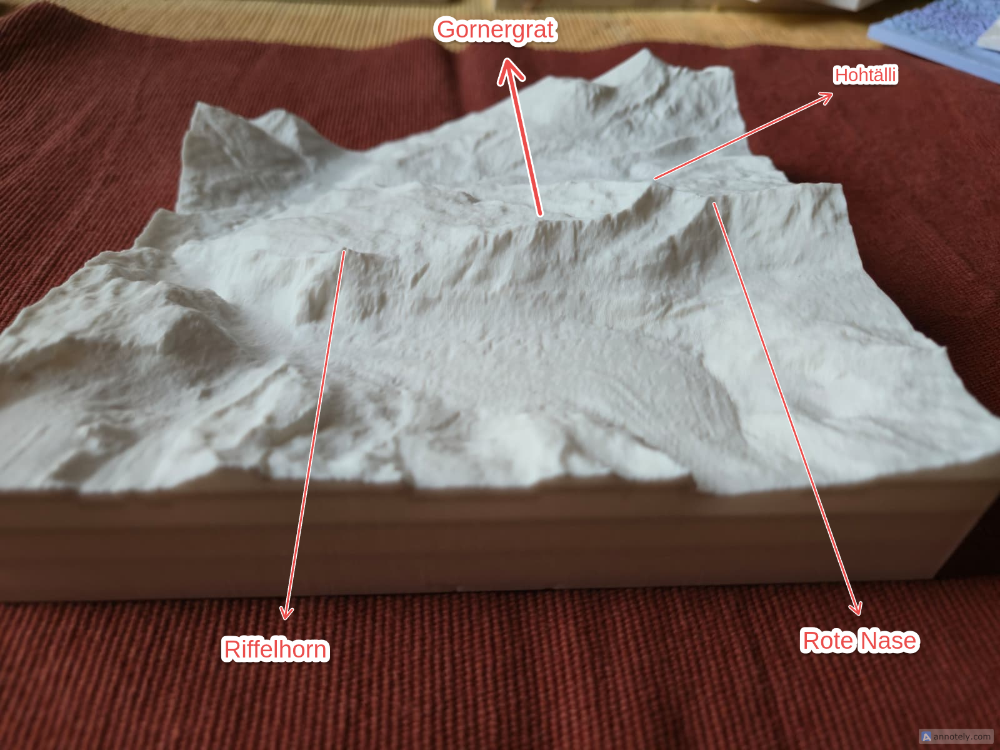
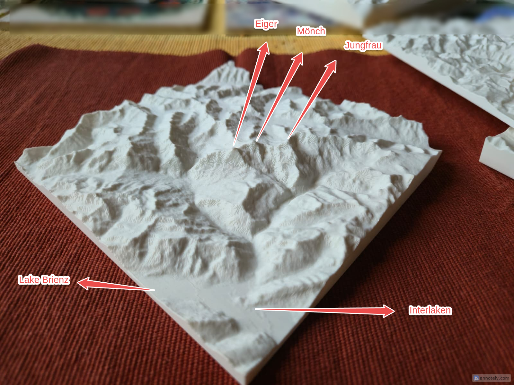

# Topotransformer

### Turn any place on Earth (or Mars) into a 3D-printable terrain model.

Pick a location, adjust the region, and download print-ready STL files — all from your browser. No cloud processing, no account needed. Your data stays on your machine.


---

## What you get

Search for any place — the Matterhorn, Grand Canyon, Mount Fuji — and Topotransformer turns real elevation data into solid 3D models you can hold in your hands.

Every export gives you **6 ready-to-print STL files**: large (220 mm), medium (160 mm), and keychain (35 mm) sizes, each at 1x and 2x vertical exaggeration. Plus matching OpenSCAD scripts if you want to tweak parameters in a CAD workflow.

| Gornergrat region — Riffelhorn, Hohtalli, Rote Nase | Grindelwald — Eiger, Monch, Jungfrau, Lake Brienz |
|---|---|
|  |  |

## Three terrain sources

- **Global** — Worldwide coverage from SRTM elevation data (~30 m resolution). Mountains, canyons, volcanoes, coastlines — anywhere on Earth.
- **Switzerland** — Ultra-high-resolution swissALTI3D data (0.5 m). Every ridge, cliff face, and alpine valley in stunning detail.
- **Mars** — MOLA elevation data (~463 m resolution). Olympus Mons, Valles Marineris, and the rest of the Red Planet.

## Print-optimized

Models are designed for FDM 3D printing out of the box:

- **Solid baseplate** with auto-calculated thickness
- **Chamfer option** for overhang-free vertical printing
- **Text engraving** on the baseplate — location name, scale ratio, and vertical exaggeration are carved into the bottom
- **Corner hole** for keychains
- **Scale ruler** engraved alongside the text
- **Tiling** — split large regions into N x N tiles that fit together

## Live preview

See a 3D preview of your terrain before committing to an export. Orbit, zoom, and inspect the model with height-colored visualization right in the sidebar.

## Resolution awareness

A built-in resolution indicator tells you whether the source data is detailed enough for your target print size. No more guessing — if you need to zoom in or reduce print resolution, the app tells you.

---

## Quick start

```
git clone <repo-url> && cd topotransformer
deno task run
```

Open `http://localhost:8000` — select a terrain source and start exploring.

### Requirements

- [Deno](https://deno.land/) runtime

### Tasks

| Command | Action |
|---------|--------|
| `deno task run` | Start the server |
| `deno task stop` | Stop the server |
| `deno task restart` | Restart |
| `deno task rmdb` | Clear database |

---

## Technical details

**Stack:** Deno backend, Vue 3 + Three.js + Leaflet.js frontend (all CDN-loaded, no bundler or build step).

**Data flow:**
```
Leaflet map selection
  → Fetch elevation tiles (RGB-encoded PNGs)
  → Decode to meters via source-specific formula
  → Generate grayscale heightmap
  → Three.js vertex displacement on PlaneGeometry
  → Solid geometry with baseplate + chamfer + text + holes
  → Binary STL export
```

**Architecture:** WebSocket communication between browser and Deno server. SQLite or JSON file database for state persistence. All 3D processing and STL generation happens client-side in the browser — the server only serves static files and proxies tile requests.

**Code style:** The entire codebase uses [APN (Abstract Prefix Notation)](https://www.techrxiv.org/users/1031649/articles/1391488-abstract-prefix-notation-apn-a-type-encoding-naming-methodology-for-programming?commit=571d0b8647fbee85c242544375a07d5cf4238bef) — a type-prefixed naming convention where every variable declares its type (`n_` number, `s_` string, `b_` boolean, `o_` object, `a_` array, `f_` function).

---

Jonas Immanuel Frey — 2026

Licensed under GPLv2. See [LICENSE](LICENSE) for details.
